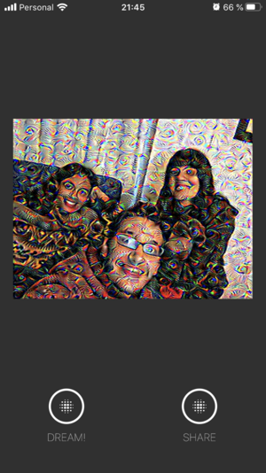

# Deep App

Flutter app to perform Deep Dream in mobile devices. Uses the [Deep API](https://github.com/rusito-23/DeepAPI.git) as back-end.

## Screenshots

| | | |
| --- | --- | --- |
|  |  |  |
|  |  |  |
